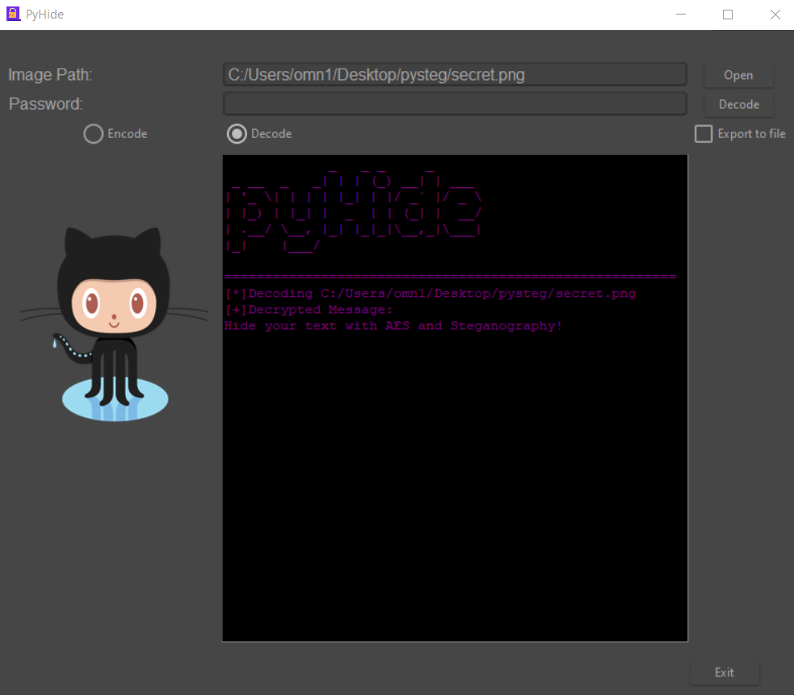

# PyHide
PyHide allows you to encrypt your data using [AES](https://en.wikipedia.org/wiki/Advanced_Encryption_Standard) encryption and then to encode it/hide it to an PNG image using lsb [steganography](https://en.wikipedia.org/wiki/Steganography) algorithm. 




# Installation

1. Clone the repository to any folder.

```
git clone https://github.com/omnone/pyHide/
```

2. Change directory into pyHide root folder.

```
cd ./pyHide
```

3. Install Python requirements

```
pip install -r requirements.txt
```


# Usage

1. Run the `pyHide/main.py` with Python

```
python3 pyHide/main.py
```


2. Click on the **Open** button beside *Image Path* field.


3. Choose the desired Image file you want to encode/decode message with.

## Encoding:

1. Type in the password.

\


2. Click on the radio checkbox saying `Encode`.


3. In the dialogue body, type in your message.


4. Click `Encode` Button.


## Decoding:

1. Type in the decoding password in the password field.


2. Click `Decode`.

The message will be shown in the dialogue body.


3. You can export the message by checking `Export to file`.
The message will be exported to a text file named `pyHide_output.txt` in the root pyHide folder.
